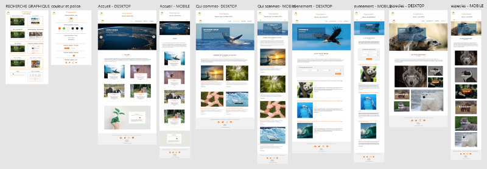

#  NewLife

**NewLife** project is a fictitious non-profit organization interested in environmental protection.

This project is part of the Graduate Fullstack developer course of Studi school. It is the first of four projects. And it is responsive (you can see it on your mobile, tablet or desktop).

What I used for this project:

- HTML
- CSS
- SASS
- BOOTSTRAP

--

I created:

- layout
- mockup
- code

###Layout

